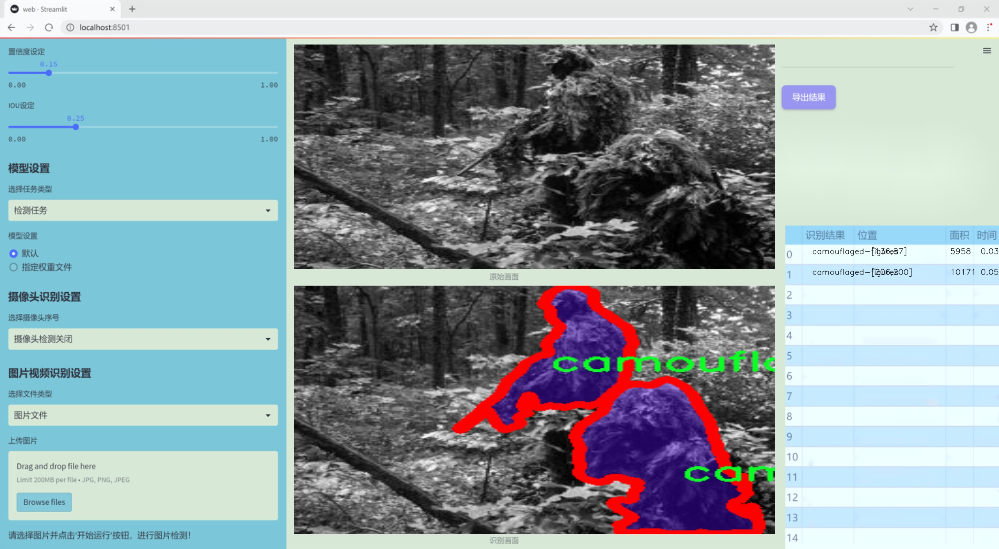
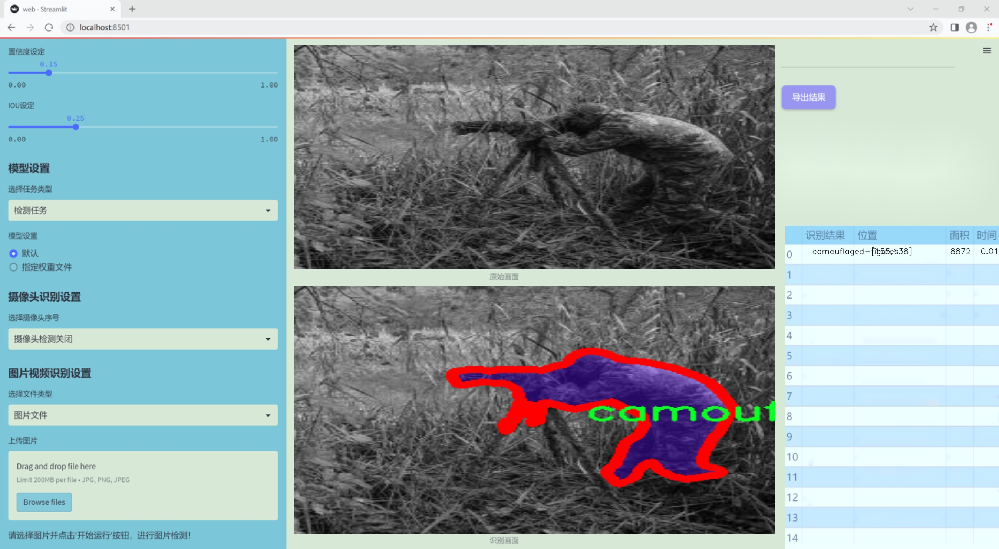
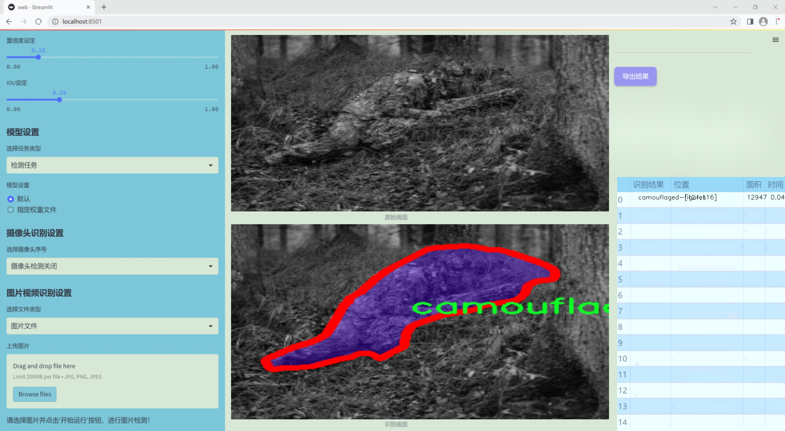
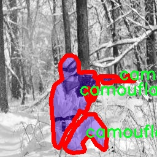
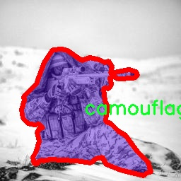
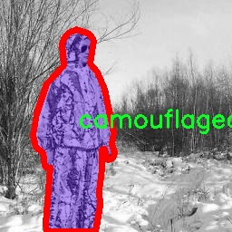

### 1.背景意义

研究背景与意义

在现代军事作战中，伪装技术的应用至关重要，尤其是在隐蔽和生存能力方面。随着战场环境的复杂性增加，传统的伪装手段已难以满足现代战争的需求。因此，开发高效的目标分割系统，以自动识别和分析伪装目标，成为军事研究的一个重要方向。基于深度学习的计算机视觉技术，尤其是目标检测和分割模型的进步，为这一领域提供了新的解决方案。

YOLO（You Only Look Once）系列模型因其高效性和实时性，广泛应用于目标检测任务。YOLOv11作为该系列的最新版本，结合了更为先进的网络结构和算法优化，能够在复杂环境中实现更高的检测精度和速度。然而，针对军事伪装目标的特定需求，现有的YOLOv11模型仍需进行改进，以提高其在特定场景下的表现。

本研究旨在基于改进的YOLOv11模型，构建一个专门针对军事伪装目标的分割系统。通过使用包含1000张图像的军事伪装分割数据集，该系统将专注于识别和分割伪装目标，提升对战场环境的感知能力。数据集中仅包含一种类别——伪装目标，这使得模型能够集中学习特定特征，从而提高分割的准确性和鲁棒性。

此外，随着数据集的不断扩展和改进，系统的性能也将不断提升。这不仅有助于提升军事行动的效率，还能够为后续的军事战略制定提供重要的数据支持。通过实现高效的伪装目标分割，本研究将为现代军事作战提供新的技术手段，推动军事智能化的发展，具有重要的理论意义和实际应用价值。

### 2.视频效果

[2.1 视频效果](https://www.bilibili.com/video/BV1EprZYBE5n/)

### 3.图片效果







##### [项目涉及的源码数据来源链接](https://kdocs.cn/l/cszuIiCKVNis)**

注意：本项目提供训练的数据集和训练教程,由于版本持续更新,暂不提供权重文件（best.pt）,请按照6.训练教程进行训练后实现上图演示的效果。

### 4.数据集信息

##### 4.1 本项目数据集类别数＆类别名

nc: 1
names: ['camouflaged-figures']


该项目为【图像分割】数据集，请在【训练教程和Web端加载模型教程（第三步）】这一步的时候按照【图像分割】部分的教程来训练

##### 4.2 本项目数据集信息介绍

本项目数据集信息介绍

本项目所使用的数据集专注于军事伪装目标的分割，旨在为改进YOLOv11的军事伪装目标分割系统提供强有力的支持。数据集的主题围绕“military camouflage segmentation”，主要用于训练模型以识别和分割伪装目标，从而提高在复杂环境下的目标检测能力。该数据集包含一个类别，即“camouflaged-figures”，这一类别涵盖了多种军事伪装形态的目标，体现了在真实战场环境中伪装技术的多样性和复杂性。

数据集的构建过程中，特别注重数据的多样性和代表性，以确保模型能够在不同的场景和条件下有效地进行伪装目标的识别与分割。数据集中的图像来源于多种军事训练和演习场景，涵盖了不同的地形、气候条件以及伪装技术的应用。这些图像经过精心标注，确保每个伪装目标都被准确地分割出来，为模型的训练提供了高质量的标注数据。

在数据集的设计中，考虑到了伪装目标在自然环境中的变化，例如光照、阴影、背景复杂性等因素。这些因素不仅影响目标的可见性，也对模型的分割性能提出了挑战。因此，数据集中包含了多种背景和环境条件下的伪装目标图像，以提高模型的鲁棒性和适应性。

通过对这一数据集的深入分析和利用，项目旨在提升YOLOv11在军事伪装目标分割任务中的表现，使其能够更准确地识别和分割伪装目标，从而为军事侦察、监视和作战决策提供重要支持。









### 5.全套项目环境部署视频教程（零基础手把手教学）

[5.1 所需软件PyCharm和Anaconda安装教程（第一步）](https://www.bilibili.com/video/BV1BoC1YCEKi/?spm_id_from=333.999.0.0&vd_source=bc9aec86d164b67a7004b996143742dc)


[5.2 安装Python虚拟环境创建和依赖库安装视频教程（第二步）](https://www.bilibili.com/video/BV1ZoC1YCEBw?spm_id_from=333.788.videopod.sections&vd_source=bc9aec86d164b67a7004b996143742dc)

### 6.改进YOLOv11训练教程和Web_UI前端加载模型教程（零基础手把手教学）

[6.1 改进YOLOv11训练教程和Web_UI前端加载模型教程（第三步）](https://www.bilibili.com/video/BV1BoC1YCEhR?spm_id_from=333.788.videopod.sections&vd_source=bc9aec86d164b67a7004b996143742dc)


按照上面的训练视频教程链接加载项目提供的数据集，运行train.py即可开始训练



     Epoch   gpu_mem       box       obj       cls    labels  img_size
     1/200     20.8G   0.01576   0.01955  0.007536        22      1280: 100%|██████████| 849/849 [14:42<00:00,  1.04s/it]
               Class     Images     Labels          P          R     mAP@.5 mAP@.5:.95: 100%|██████████| 213/213 [01:14<00:00,  2.87it/s]
                 all       3395      17314      0.994      0.957      0.0957      0.0843

     Epoch   gpu_mem       box       obj       cls    labels  img_size
     2/200     20.8G   0.01578   0.01923  0.007006        22      1280: 100%|██████████| 849/849 [14:44<00:00,  1.04s/it]
               Class     Images     Labels          P          R     mAP@.5 mAP@.5:.95: 100%|██████████| 213/213 [01:12<00:00,  2.95it/s]
                 all       3395      17314      0.996      0.956      0.0957      0.0845

     Epoch   gpu_mem       box       obj       cls    labels  img_size
     3/200     20.8G   0.01561    0.0191  0.006895        27      1280: 100%|██████████| 849/849 [10:56<00:00,  1.29it/s]
               Class     Images     Labels          P          R     mAP@.5 mAP@.5:.95: 100%|███████   | 187/213 [00:52<00:00,  4.04it/s]
                 all       3395      17314      0.996      0.957      0.0957      0.0845


###### [项目数据集下载链接](https://kdocs.cn/l/cszuIiCKVNis)

### 7.原始YOLOv11算法讲解


###### YOLOv11改进方向

与YOLOv 10相比，YOLOv 11有了巨大的改进，包括但不限于：

  * 增强的模型结构：模型具有改进的模型结构，以获取图像处理并形成预测
  * GPU优化：这是现代ML模型的反映，GPU训练ML模型在速度和准确性上都更好。
  * 速度：YOLOv 11模型现在经过增强和GPU优化以用于训练。通过优化，这些模型比它们的前版本快得多。在速度上达到了25%的延迟减少！
  * 更少的参数：更少的参数允许更快的模型，但v11的准确性不受影响
  * 更具适应性：更多支持的任务YOLOv 11支持多种类型的任务、多种类型的对象和多种类型的图像。

###### YOLOv11功能介绍

Glenn Jocher和他的团队制作了一个令人敬畏的YOLOv 11迭代，并且在图像人工智能的各个方面都提供了YOLO。YOLOv 11有多种型号，包括：

  * 对象检测-在训练时检测图像中的对象
  * 图像分割-超越对象检测，分割出图像中的对象
  * 姿态检测-当用点和线训练时绘制一个人的姿势
  * 定向检测（OBB）：类似于对象检测，但包围盒可以旋转
  * 图像分类-在训练时对图像进行分类

使用Ultralytics Library，这些模型还可以进行优化，以：

  * 跟踪-可以跟踪对象的路径
  * 易于导出-库可以以不同的格式和目的导出
  * 多场景-您可以针对不同的对象和图像训练模型

此外，Ultralytics还推出了YOLOv 11的企业模型，该模型将于10月31日发布。这将与开源的YOLOv
11模型并行，但将拥有更大的专有Ultralytics数据集。YOLOv 11是“建立在过去的成功”的其他版本的之上。

###### YOLOv11模型介绍

YOLOv 11附带了边界框模型（无后缀），实例分割（-seg），姿态估计（-pose），定向边界框（-obb）和分类（-cls）。

这些也有不同的尺寸：纳米（n），小（s），中（m），大（l），超大（x）。


YOLOv11模型

###### YOLOv11与前版本对比

与YOLOv10和YOLOv8相比，YOLOv11在Ultralytics的任何帖子中都没有直接提到。所以我会收集所有的数据来比较它们。感谢Ultralytics：

**检测：**


YOLOv11检测统计


YOLOv10检测统计

其中，Nano的mAPval在v11上为39.5，v10上为38.5；Small为47.0 vs 46.3，Medium为51.5 vs
51.1，Large为53.4 vs 53.2，Extra Large为54.7vs
54.4。现在，这可能看起来像是一种增量增加，但小小数的增加可能会对ML模型产生很大影响。总体而言，YOLOv11以0.3
mAPval的优势追平或击败YOLOv10。

现在，我们必须看看速度。在延迟方面，Nano在v11上为1.55 , v10上为1.84，Small为2.46 v2.49，Medium为4.70
v4.74，Large为6.16 v7.28，Extra Large为11.31
v10.70。延迟越低越好。YOLOv11提供了一个非常低的延迟相比，除了特大做得相当差的前身。

总的来说，Nano模型是令人振奋的，速度更快，性能相当。Extra Large在性能上有很好的提升，但它的延迟非常糟糕。

**分割：**


YOLOV11 分割统计


YOLOV9 分割统计


YOLOV8 分割数据

总体而言，YOLOv 11上的分割模型在大型和超大型模型方面比上一代YOLOv 8和YOLOv 9做得更好。

YOLOv 9 Segmentation没有提供任何关于延迟的统计数据。比较YOLOv 11延迟和YOLOv 8延迟，发现YOLOv 11比YOLOv
8快得多。YOLOv 11将大量GPU集成到他们的模型中，因此期望他们的模型甚至比CPU测试的基准更快！

姿态估计：


YOLOV11姿态估计统计


YOLOV8姿态估计统计

YOLOv 11的mAP 50 -95统计量也逐渐优于先前的YOLOv 8（除大型外）。然而，在速度方面，YOLOv
11姿势可以最大限度地减少延迟。其中一些延迟指标是版本的1/4！通过对这些模型进行GPU训练优化，我可以看到指标比显示的要好得多。

**定向边界框：**


YOLOv11 OBB统计


YOLOv8 OBB统计

OBB统计数据在mAP
50上并不是很好，只有非常小的改进，在某种程度上小于检测中的微小改进。然而，从v8到v11的速度减半，这表明YOLOv11在速度上做了很多努力。

**最后，分类：**


YOLOv 11 CLS统计


YOLOv8 CLS统计

从v8到v11，准确性也有了微小的提高。然而，速度大幅上升，CPU速度更快的型号。


### 8.200+种全套改进YOLOV11创新点原理讲解

#### 8.1 200+种全套改进YOLOV11创新点原理讲解大全

由于篇幅限制，每个创新点的具体原理讲解就不全部展开，具体见下列网址中的改进模块对应项目的技术原理博客网址【Blog】（创新点均为模块化搭建，原理适配YOLOv5~YOLOv11等各种版本）

[改进模块技术原理博客【Blog】网址链接](https://gitee.com/qunmasj/good)


#### 8.2 精选部分改进YOLOV11创新点原理讲解

###### 这里节选部分改进创新点展开原理讲解(完整的改进原理见上图和[改进模块技术原理博客链接](https://gitee.com/qunmasj/good)【如果此小节的图加载失败可以通过CSDN或者Github搜索该博客的标题访问原始博客，原始博客图片显示正常】

### RCS-OSA的基本原理
参考该博客，RCSOSA（RCS-One-Shot Aggregation）是RCS-YOLO中提出的一种结构，我们可以将主要原理概括如下：

1. RCS（Reparameterized Convolution based on channel Shuffle）: 结合了通道混洗，通过重参数化卷积来增强网络的特征提取能力。

2. RCS模块: 在训练阶段，利用多分支结构学习丰富的特征表示；在推理阶段，通过结构化重参数化简化为单一分支，减少内存消耗。

3. OSA（One-Shot Aggregation）: 一次性聚合多个特征级联，减少网络计算负担，提高计算效率。

4. 特征级联: RCS-OSA模块通过堆叠RCS，确保特征的复用并加强不同层之间的信息流动。

#### RCS
RCS（基于通道Shuffle的重参数化卷积）是RCS-YOLO的核心组成部分，旨在训练阶段通过多分支结构学习丰富的特征信息，并在推理阶段通过简化为单分支结构来减少内存消耗，实现快速推理。此外，RCS利用通道分割和通道Shuffle操作来降低计算复杂性，同时保持通道间的信息交换，这样在推理阶段相比普通的3×3卷积可以减少一半的计算复杂度。通过结构重参数化，RCS能够在训练阶段从输入特征中学习深层表示，并在推理阶段实现快速推理，同时减少内存消耗。

#### RCS模块
RCS（基于通道Shuffle的重参数化卷积）模块中，结构在训练阶段使用多个分支，包括1x1和3x3的卷积，以及一个直接的连接（Identity），用于学习丰富的特征表示。在推理阶段，结构被重参数化成一个单一的3x3卷积，以减少计算复杂性和内存消耗，同时保持训练阶段学到的特征表达能力。这与RCS的设计理念紧密相连，即在不牺牲性能的情况下提高计算效率。


上图为大家展示了RCS的结构，分为训练阶段（a部分）和推理阶段（b部分）。在训练阶段，输入通过通道分割，一部分输入经过RepVGG块，另一部分保持不变。然后通过1x1卷积和3x3卷积处理RepVGG块的输出，与另一部分输入进行通道Shuffle和连接。在推理阶段，原来的多分支结构被简化为一个单一的3x3 RepConv块。这种设计允许在训练时学习复杂特征，在推理时减少计算复杂度。黑色边框的矩形代表特定的模块操作，渐变色的矩形代表张量的特定特征，矩形的宽度代表张量的通道数。 

#### OSA
OSA（One-Shot Aggregation）是一个关键的模块，旨在提高网络在处理密集连接时的效率。OSA模块通过表示具有多个感受野的多样化特征，并在最后的特征映射中仅聚合一次所有特征，从而克服了DenseNet中密集连接的低效率问题。

OSA模块的使用有两个主要目的：

1. 提高特征表示的多样性：OSA通过聚合具有不同感受野的特征来增加网络对于不同尺度的敏感性，这有助于提升模型对不同大小目标的检测能力。

2. 提高效率：通过在网络的最后一部分只进行一次特征聚合，OSA减少了重复的特征计算和存储需求，从而提高了网络的计算和能源效率。

在RCS-YOLO中，OSA模块被进一步与RCS（基于通道Shuffle的重参数化卷积）相结合，形成RCS-OSA模块。这种结合不仅保持了低成本的内存消耗，而且还实现了语义信息的有效提取，对于构建轻量级和大规模的对象检测器尤为重要。

下面我将为大家展示RCS-OSA（One-Shot Aggregation of RCS）的结构。


在RCS-OSA模块中，输入被分为两部分，一部分直接通过，另一部分通过堆叠的RCS模块进行处理。处理后的特征和直接通过的特征在通道混洗（Channel Shuffle）后合并。这种结构设计用于增强模型的特征提取和利用效率，是RCS-YOLO架构中的一个关键组成部分旨在通过一次性聚合来提高模型处理特征的能力，同时保持计算效率。

#### 特征级联
特征级联（feature cascade）是一种技术，通过在网络的一次性聚合（one-shot aggregate）路径上维持有限数量的特征级联来实现的。在RCS-YOLO中，特别是在RCS-OSA（RCS-Based One-Shot Aggregation）模块中，只保留了三个特征级联。

特征级联的目的是为了减轻网络计算负担并降低内存占用。这种方法可以有效地聚合不同层次的特征，提高模型的语义信息提取能力，同时避免了过度复杂化网络结构所带来的低效率和高资源消耗。

下面为大家提供的图像展示的是RCS-YOLO的整体架构，其中包括RCS-OSA模块。RCS-OSA在模型中用于堆叠RCS模块，以确保特征的复用并加强不同层之间的信息流动。图中显示的多层RCS-OSA模块的排列和组合反映了它们如何一起工作以优化特征传递和提高检测性能。


总结：RCS-YOLO主要由RCS-OSA（蓝色模块）和RepVGG（橙色模块）构成。这里的n代表堆叠RCS模块的数量。n_cls代表检测到的对象中的类别数量。图中的IDetect是从YOLOv11中借鉴过来的，表示使用二维卷积神经网络的检测层。这个架构通过堆叠的RCS模块和RepVGG模块，以及两种类型的检测层，实现了对象检测的任务。 


### 9.系统功能展示

图9.1.系统支持检测结果表格显示

  图9.2.系统支持置信度和IOU阈值手动调节

  图9.3.系统支持自定义加载权重文件best.pt(需要你通过步骤5中训练获得)

  图9.4.系统支持摄像头实时识别

  图9.5.系统支持图片识别

  图9.6.系统支持视频识别

  图9.7.系统支持识别结果文件自动保存

  图9.8.系统支持Excel导出检测结果数据


### 10. YOLOv11核心改进源码讲解

#### 10.1 hcfnet.py

以下是对给定代码的核心部分进行提炼和详细注释的结果：

```python
import math
import torch
import torch.nn as nn
import torch.nn.functional as F

# 定义空间注意力模块
class SpatialAttentionModule(nn.Module):
    def __init__(self):
        super(SpatialAttentionModule, self).__init__()
        # 使用卷积层将输入的通道数从2降到1
        self.conv2d = nn.Conv2d(in_channels=2, out_channels=1, kernel_size=7, stride=1, padding=3)
        self.sigmoid = nn.Sigmoid()  # Sigmoid激活函数

    def forward(self, x):
        # 计算输入的平均值和最大值
        avgout = torch.mean(x, dim=1, keepdim=True)  # 沿通道维度计算平均值
        maxout, _ = torch.max(x, dim=1, keepdim=True)  # 沿通道维度计算最大值
        out = torch.cat([avgout, maxout], dim=1)  # 将平均值和最大值拼接
        out = self.sigmoid(self.conv2d(out))  # 通过卷积和Sigmoid激活
        return out * x  # 将注意力权重应用于输入

# 定义局部-全局注意力模块
class LocalGlobalAttention(nn.Module):
    def __init__(self, output_dim, patch_size):
        super().__init__()
        self.output_dim = output_dim
        self.patch_size = patch_size
        self.mlp1 = nn.Linear(patch_size * patch_size, output_dim // 2)  # MLP层1
        self.norm = nn.LayerNorm(output_dim // 2)  # 层归一化
        self.mlp2 = nn.Linear(output_dim // 2, output_dim)  # MLP层2
        self.conv = nn.Conv2d(output_dim, output_dim, kernel_size=1)  # 1x1卷积
        self.prompt = torch.nn.parameter.Parameter(torch.randn(output_dim, requires_grad=True))  # 可学习的参数
        self.top_down_transform = torch.nn.parameter.Parameter(torch.eye(output_dim), requires_grad=True)  # 可学习的变换矩阵

    def forward(self, x):
        x = x.permute(0, 2, 3, 1)  # 调整维度顺序
        B, H, W, C = x.shape  # 获取批量大小、高度、宽度和通道数
        P = self.patch_size

        # 局部分支
        local_patches = x.unfold(1, P, P).unfold(2, P, P)  # 获取局部补丁
        local_patches = local_patches.reshape(B, -1, P * P, C)  # 重塑形状
        local_patches = local_patches.mean(dim=-1)  # 沿最后一个维度计算平均值

        local_patches = self.mlp1(local_patches)  # 通过MLP层1
        local_patches = self.norm(local_patches)  # 归一化
        local_patches = self.mlp2(local_patches)  # 通过MLP层2

        local_attention = F.softmax(local_patches, dim=-1)  # 计算局部注意力
        local_out = local_patches * local_attention  # 应用注意力权重

        # 计算余弦相似度
        cos_sim = F.normalize(local_out, dim=-1) @ F.normalize(self.prompt[None, ..., None], dim=1)  # 计算余弦相似度
        mask = cos_sim.clamp(0, 1)  # 限制在[0, 1]范围内
        local_out = local_out * mask  # 应用掩码
        local_out = local_out @ self.top_down_transform  # 应用变换矩阵

        # 恢复形状
        local_out = local_out.reshape(B, H // P, W // P, self.output_dim)  # 恢复到原始的空间维度
        local_out = local_out.permute(0, 3, 1, 2)  # 调整维度顺序
        local_out = F.interpolate(local_out, size=(H, W), mode='bilinear', align_corners=False)  # 上采样
        output = self.conv(local_out)  # 通过1x1卷积

        return output  # 返回输出

# 定义PPA模块
class PPA(nn.Module):
    def __init__(self, in_features, filters) -> None:
        super().__init__()
        self.skip = nn.Conv2d(in_features, filters, kernel_size=1)  # 跳跃连接
        self.c1 = nn.Conv2d(filters, filters, kernel_size=3, padding=1)  # 卷积层1
        self.c2 = nn.Conv2d(filters, filters, kernel_size=3, padding=1)  # 卷积层2
        self.c3 = nn.Conv2d(filters, filters, kernel_size=3, padding=1)  # 卷积层3
        self.sa = SpatialAttentionModule()  # 空间注意力模块
        self.lga2 = LocalGlobalAttention(filters, 2)  # 局部-全局注意力模块，patch_size=2
        self.lga4 = LocalGlobalAttention(filters, 4)  # 局部-全局注意力模块，patch_size=4
        self.bn1 = nn.BatchNorm2d(filters)  # 批归一化
        self.silu = nn.SiLU()  # SiLU激活函数

    def forward(self, x):
        x_skip = self.skip(x)  # 跳跃连接
        x_lga2 = self.lga2(x_skip)  # 局部-全局注意力
        x_lga4 = self.lga4(x_skip)  # 局部-全局注意力
        x1 = self.c1(x)  # 卷积操作
        x2 = self.c2(x1)  # 卷积操作
        x3 = self.c3(x2)  # 卷积操作
        # 合并不同路径的输出
        x = x1 + x2 + x3 + x_skip + x_lga2 + x_lga4
        x = self.bn1(x)  # 批归一化
        x = self.sa(x)  # 空间注意力
        x = self.silu(x)  # 激活函数
        return x  # 返回输出

# 定义DASI模块
class DASI(nn.Module):
    def __init__(self, in_features, out_features) -> None:
        super().__init__()
        self.tail_conv = nn.Conv2d(out_features, out_features, kernel_size=1)  # 尾部卷积
        self.conv = nn.Conv2d(out_features // 2, out_features // 4, kernel_size=1)  # 卷积
        self.bns = nn.BatchNorm2d(out_features)  # 批归一化
        self.skips = nn.Conv2d(in_features[1], out_features, kernel_size=1)  # 跳跃连接
        self.silu = nn.SiLU()  # SiLU激活函数

    def forward(self, x_list):
        x_low, x, x_high = x_list  # 解包输入
        x = self.skips(x)  # 跳跃连接
        x_skip = x  # 保存跳跃连接的输出
        x = torch.chunk(x, 4, dim=1)  # 将输出分成4个部分
        # 根据高低分支的存在与否进行处理
        if x_high is not None:
            x_high = self.skips(x_high)
            x_high = torch.chunk(x_high, 4, dim=1)
        if x_low is not None:
            x_low = self.skips(x_low)
            x_low = F.interpolate(x_low, size=[x.size(2), x.size(3)], mode='bilinear', align_corners=True)
            x_low = torch.chunk(x_low, 4, dim=1)

        # 结合不同分支的输出
        x0 = self.conv(torch.cat((x[0], x_low[0]), dim=1)) if x_low is not None else self.conv(x[0])
        x1 = self.conv(torch.cat((x[1], x_low[1]), dim=1)) if x_low is not None else self.conv(x[1])
        x2 = self.conv(torch.cat((x[2], x_low[2]), dim=1)) if x_low is not None else self.conv(x[2])
        x3 = self.conv(torch.cat((x[3], x_low[3]), dim=1)) if x_low is not None else self.conv(x[3])

        x = torch.cat((x0, x1, x2, x3), dim=1)  # 合并输出
        x = self.tail_conv(x)  # 尾部卷积
        x += x_skip  # 加上跳跃连接
        x = self.bns(x)  # 批归一化
        x = self.silu(x)  # 激活函数
        return x  # 返回输出
```

### 注释说明
1. **SpatialAttentionModule**: 该模块通过计算输入特征图的平均值和最大值，生成一个空间注意力权重，并将其应用于输入特征图。
2. **LocalGlobalAttention**: 该模块结合局部和全局信息，通过多层感知机（MLP）处理局部补丁，并生成输出特征图。
3. **PPA**: 该模块整合了多个卷积层、空间注意力和局部-全局注意力，输出经过激活函数处理的特征图。
4. **DASI**: 该模块结合不同尺度的特征，通过跳跃连接和卷积操作，生成最终的输出特征图。

以上代码保留了核心功能，并提供了详细的中文注释，便于理解每个模块的作用和流程。

这个文件 `hcfnet.py` 定义了一些用于深度学习的模块，主要是用于图像处理和特征提取的神经网络组件。文件中包含多个类，每个类实现了特定的功能。

首先，`SpatialAttentionModule` 类实现了空间注意力机制。它通过对输入特征图进行平均池化和最大池化，生成两个特征图，然后将这两个特征图拼接在一起，经过一个卷积层和 Sigmoid 激活函数，得到一个注意力权重图。最后，这个权重图与输入特征图相乘，从而增强了重要特征的表达。

接下来是 `LocalGlobalAttention` 类，它结合了局部和全局特征。输入特征图被划分为多个小块（patches），并通过 MLP（多层感知机）进行处理。局部特征经过处理后，通过 softmax 函数生成注意力权重，进而与局部特征相乘，得到加权后的局部特征。然后，这些特征被恢复到原始形状，并通过一个卷积层进行进一步处理。

`ECA` 类实现了有效通道注意力机制。它根据输入通道的数量动态计算卷积核的大小，并通过自适应平均池化和一维卷积来生成通道注意力权重，最后将权重应用于输入特征图。

`PPA` 类是一个复杂的模块，整合了多个组件，包括跳跃连接、卷积层、空间注意力模块、有效通道注意力和局部全局注意力。它通过多次卷积和注意力机制来提取特征，并通过 Batch Normalization 和激活函数进行非线性变换。

`Bag` 类实现了一个简单的加权求和机制，用于结合不同来源的特征。它根据输入的注意力图对特征进行加权，增强重要特征的影响。

最后，`DASI` 类是一个更高层次的模块，结合了多个输入特征图，利用跳跃连接和卷积层来融合特征。它通过 Bag 类将不同层次的特征结合在一起，并通过尾部卷积和 Batch Normalization 进行处理，最终输出融合后的特征图。

总体来说，这个文件定义了一些复杂的注意力机制和特征融合模块，旨在提高图像处理任务中的特征提取能力，适用于各种深度学习应用。

#### 10.2 metaformer.py

以下是代码中最核心的部分，并附上详细的中文注释：

```python
import torch
import torch.nn as nn
import torch.nn.functional as F

class MF_Attention(nn.Module):
    """
    自注意力机制（Vanilla Self-Attention）实现，参考Transformer论文。
    """
    def __init__(self, dim, head_dim=32, num_heads=None, qkv_bias=False,
                 attn_drop=0., proj_drop=0., proj_bias=False):
        super().__init__()

        # 设置每个头的维度和缩放因子
        self.head_dim = head_dim
        self.scale = head_dim ** -0.5

        # 计算头的数量
        self.num_heads = num_heads if num_heads else dim // head_dim
        if self.num_heads == 0:
            self.num_heads = 1
        
        # 计算注意力的维度
        self.attention_dim = self.num_heads * self.head_dim

        # 定义线性层用于计算Q、K、V
        self.qkv = nn.Linear(dim, self.attention_dim * 3, bias=qkv_bias)
        self.attn_drop = nn.Dropout(attn_drop)  # 注意力的dropout
        self.proj = nn.Linear(self.attention_dim, dim, bias=proj_bias)  # 投影层
        self.proj_drop = nn.Dropout(proj_drop)  # 投影后的dropout

    def forward(self, x):
        B, H, W, C = x.shape  # 获取输入的形状
        N = H * W  # 计算序列长度
        # 计算Q、K、V
        qkv = self.qkv(x).reshape(B, N, 3, self.num_heads, self.head_dim).permute(2, 0, 3, 1, 4)
        q, k, v = qkv.unbind(0)  # 分离Q、K、V

        # 计算注意力权重
        attn = (q @ k.transpose(-2, -1)) * self.scale  # 缩放点积
        attn = attn.softmax(dim=-1)  # softmax归一化
        attn = self.attn_drop(attn)  # 应用dropout

        # 计算输出
        x = (attn @ v).transpose(1, 2).reshape(B, H, W, self.attention_dim)  # 应用注意力权重
        x = self.proj(x)  # 投影回原始维度
        x = self.proj_drop(x)  # 应用dropout
        return x  # 返回输出

class Mlp(nn.Module):
    """ 
    多层感知机（MLP）实现，通常用于MetaFormer模型。
    """
    def __init__(self, dim, mlp_ratio=4, out_features=None, act_layer=nn.ReLU, drop=0., bias=False):
        super().__init__()
        in_features = dim
        out_features = out_features or in_features
        hidden_features = int(mlp_ratio * in_features)  # 隐藏层特征数
        drop_probs = (drop, drop)  # dropout概率

        # 定义两层线性层和激活函数
        self.fc1 = nn.Linear(in_features, hidden_features, bias=bias)
        self.act = act_layer()  # 激活函数
        self.drop1 = nn.Dropout(drop_probs[0])  # 第一个dropout
        self.fc2 = nn.Linear(hidden_features, out_features, bias=bias)
        self.drop2 = nn.Dropout(drop_probs[1])  # 第二个dropout

    def forward(self, x):
        x = self.fc1(x)  # 第一个线性层
        x = self.act(x)  # 激活
        x = self.drop1(x)  # 第一个dropout
        x = self.fc2(x)  # 第二个线性层
        x = self.drop2(x)  # 第二个dropout
        return x  # 返回输出

class MetaFormerBlock(nn.Module):
    """
    实现一个MetaFormer块。
    """
    def __init__(self, dim,
                 token_mixer=nn.Identity, mlp=Mlp,
                 norm_layer=nn.LayerNorm,
                 drop=0., drop_path=0.,
                 layer_scale_init_value=None, res_scale_init_value=None):
        super().__init__()

        # 归一化层
        self.norm1 = norm_layer(dim)
        self.token_mixer = token_mixer(dim=dim, drop=drop)  # 令牌混合器
        self.drop_path1 = nn.Dropout(drop_path) if drop_path > 0. else nn.Identity()  # DropPath
        self.layer_scale1 = nn.Parameter(torch.ones(dim)) if layer_scale_init_value else nn.Identity()  # 层缩放
        self.res_scale1 = nn.Parameter(torch.ones(dim)) if res_scale_init_value else nn.Identity()  # 残差缩放

        self.norm2 = norm_layer(dim)
        self.mlp = mlp(dim=dim, drop=drop)  # MLP
        self.drop_path2 = nn.Dropout(drop_path) if drop_path > 0. else nn.Identity()  # DropPath
        self.layer_scale2 = nn.Parameter(torch.ones(dim)) if layer_scale_init_value else nn.Identity()  # 层缩放
        self.res_scale2 = nn.Parameter(torch.ones(dim)) if res_scale_init_value else nn.Identity()  # 残差缩放

    def forward(self, x):
        x = x.permute(0, 2, 3, 1)  # 调整维度顺序
        # 第一部分：归一化 -> 令牌混合 -> 残差连接
        x = self.res_scale1(x) + \
            self.layer_scale1(
                self.drop_path1(
                    self.token_mixer(self.norm1(x))
                )
            )
        # 第二部分：归一化 -> MLP -> 残差连接
        x = self.res_scale2(x) + \
            self.layer_scale2(
                self.drop_path2(
                    self.mlp(self.norm2(x))
                )
            )
        return x.permute(0, 3, 1, 2)  # 返回到原始维度顺序
```

### 代码核心部分说明：
1. **MF_Attention**：实现了自注意力机制，主要包括计算Q、K、V的线性变换，计算注意力权重，并将其应用于值V上，最后通过线性层进行投影。
2. **Mlp**：实现了一个简单的多层感知机，包括两个线性层和激活函数，支持dropout。
3. **MetaFormerBlock**：实现了一个MetaFormer块，包含归一化、令牌混合、MLP等模块，支持残差连接和层缩放。

这个程序文件 `metaformer.py` 实现了一种名为 MetaFormer 的深度学习模型，主要用于计算机视觉任务。代码中包含多个模块和类，每个类负责特定的功能。以下是对代码的详细说明。

首先，文件导入了一些必要的库，包括 `torch` 和 `torch.nn`，以及一些来自 `timm` 库的组件。这些库提供了构建神经网络所需的基本工具和函数。

接下来，定义了几个基本的神经网络层和激活函数。`Scale` 类用于按元素乘以一个可训练的缩放向量。`SquaredReLU` 和 `StarReLU` 是两种不同的激活函数，分别实现了平方的 ReLU 和带有缩放和偏置的 ReLU。

`MF_Attention` 类实现了基本的自注意力机制，类似于 Transformer 中的自注意力。它通过线性变换生成查询、键和值，并计算注意力权重，最后将结果投影回原始维度。

`RandomMixing` 类则实现了一种随机混合机制，使用一个随机矩阵对输入进行变换，增强模型的表达能力。

`LayerNormGeneral` 类是一个通用的层归一化实现，可以根据输入的形状和需求自定义缩放和偏置。`LayerNormWithoutBias` 是其一个优化版本，不使用偏置以提高计算效率。

`SepConv` 类实现了反向可分离卷积，通常用于降低计算复杂度。它首先通过一个线性层进行逐点卷积，然后进行深度卷积，最后再通过另一个线性层输出。

`Pooling` 类实现了一种特定的池化操作，适用于 PoolFormer 模型，通过平均池化来减少特征图的尺寸。

`Mlp` 类实现了多层感知机（MLP），用于在 MetaFormer 模型中进行特征变换。它包含两个线性层和激活函数，并在每层之间应用 dropout。

`ConvolutionalGLU` 类实现了一种卷积门控线性单元（GLU），结合了卷积操作和门控机制，以提高模型的非线性表达能力。

`MetaFormerBlock` 和 `MetaFormerCGLUBlock` 类分别实现了 MetaFormer 的基本模块。它们通过归一化、令牌混合、MLP 以及残差连接来构建深度网络的基本单元。`MetaFormerCGLUBlock` 采用了卷积 GLU 作为 MLP，而 `MetaFormerBlock` 则使用了标准的 MLP。

整体而言，这个文件定义了一系列构建 MetaFormer 模型所需的组件，提供了灵活的模块化设计，便于在不同的视觉任务中进行组合和应用。通过这些类，用户可以方便地构建、训练和评估 MetaFormer 模型。

#### 10.3 fasternet.py

以下是经过简化并注释的核心代码部分，主要包含了模型的定义和前向传播过程。

```python
import torch
import torch.nn as nn
from typing import List
from torch import Tensor

class Partial_conv3(nn.Module):
    """部分卷积层，用于在不同的前向传播模式下处理输入"""
    
    def __init__(self, dim, n_div, forward):
        super().__init__()
        self.dim_conv3 = dim // n_div  # 部分卷积的通道数
        self.dim_untouched = dim - self.dim_conv3  # 未处理的通道数
        self.partial_conv3 = nn.Conv2d(self.dim_conv3, self.dim_conv3, 3, 1, 1, bias=False)  # 3x3卷积

        # 根据前向传播模式选择方法
        if forward == 'slicing':
            self.forward = self.forward_slicing
        elif forward == 'split_cat':
            self.forward = self.forward_split_cat
        else:
            raise NotImplementedError

    def forward_slicing(self, x: Tensor) -> Tensor:
        """仅用于推理阶段的前向传播"""
        x = x.clone()  # 保持原始输入不变，以便后续的残差连接
        x[:, :self.dim_conv3, :, :] = self.partial_conv3(x[:, :self.dim_conv3, :, :])  # 处理部分通道
        return x

    def forward_split_cat(self, x: Tensor) -> Tensor:
        """用于训练和推理阶段的前向传播"""
        x1, x2 = torch.split(x, [self.dim_conv3, self.dim_untouched], dim=1)  # 按通道分割
        x1 = self.partial_conv3(x1)  # 处理部分通道
        x = torch.cat((x1, x2), 1)  # 连接处理后的通道和未处理的通道
        return x


class MLPBlock(nn.Module):
    """多层感知机块，包含卷积、归一化和激活函数"""
    
    def __init__(self, dim, n_div, mlp_ratio, drop_path, layer_scale_init_value, act_layer, norm_layer, pconv_fw_type):
        super().__init__()
        self.dim = dim
        self.mlp_ratio = mlp_ratio
        self.drop_path = nn.Identity() if drop_path <= 0 else nn.Dropout(drop_path)  # 随机丢弃层
        self.n_div = n_div

        mlp_hidden_dim = int(dim * mlp_ratio)  # 隐藏层维度

        # 定义MLP层
        mlp_layer: List[nn.Module] = [
            nn.Conv2d(dim, mlp_hidden_dim, 1, bias=False),
            norm_layer(mlp_hidden_dim),
            act_layer(),
            nn.Conv2d(mlp_hidden_dim, dim, 1, bias=False)
        ]
        self.mlp = nn.Sequential(*mlp_layer)  # 将MLP层组合成一个序列

        # 初始化部分卷积
        self.spatial_mixing = Partial_conv3(dim, n_div, pconv_fw_type)

    def forward(self, x: Tensor) -> Tensor:
        """前向传播函数"""
        shortcut = x  # 保存输入以进行残差连接
        x = self.spatial_mixing(x)  # 进行空间混合
        x = shortcut + self.drop_path(self.mlp(x))  # 残差连接
        return x


class FasterNet(nn.Module):
    """FasterNet模型定义"""
    
    def __init__(self, in_chans=3, num_classes=1000, embed_dim=96, depths=(1, 2, 8, 2), mlp_ratio=2., n_div=4, 
                 patch_size=4, patch_stride=4, patch_size2=2, patch_stride2=2, patch_norm=True, drop_path_rate=0.1, 
                 layer_scale_init_value=0, norm_layer=nn.BatchNorm2d, act_layer=nn.ReLU):
        super().__init__()

        self.num_stages = len(depths)  # 模型阶段数
        self.embed_dim = embed_dim  # 嵌入维度
        self.patch_embed = nn.Conv2d(in_chans, embed_dim, kernel_size=patch_size, stride=patch_stride, bias=False)  # 图像嵌入层

        # 构建各个阶段的基本块
        stages_list = []
        for i_stage in range(self.num_stages):
            stage = BasicStage(dim=int(embed_dim * 2 ** i_stage), n_div=n_div, depth=depths[i_stage], 
                               mlp_ratio=mlp_ratio, drop_path=drop_path_rate, layer_scale_init_value=layer_scale_init_value, 
                               norm_layer=norm_layer, act_layer=act_layer, pconv_fw_type='split_cat')
            stages_list.append(stage)

        self.stages = nn.Sequential(*stages_list)  # 将所有阶段组合成一个序列

    def forward(self, x: Tensor) -> Tensor:
        """前向传播函数"""
        x = self.patch_embed(x)  # 嵌入输入图像
        outs = []
        for stage in self.stages:
            x = stage(x)  # 通过每个阶段
            outs.append(x)  # 收集输出
        return outs  # 返回各阶段的输出


# 示例：创建FasterNet模型并进行前向传播
if __name__ == '__main__':
    model = FasterNet()  # 实例化模型
    inputs = torch.randn((1, 3, 640, 640))  # 创建随机输入
    outputs = model(inputs)  # 前向传播
    for output in outputs:
        print(output.size())  # 打印每个阶段的输出尺寸
```

### 代码说明：
1. **Partial_conv3**: 该类实现了部分卷积操作，可以根据不同的前向传播模式处理输入。
2. **MLPBlock**: 该类实现了多层感知机块，包含卷积、归一化和激活函数，并实现了残差连接。
3. **FasterNet**: 该类是整个模型的定义，包含多个阶段，每个阶段由多个 `MLPBlock` 组成。模型的前向传播过程通过嵌入层和各个阶段的处理来完成。
4. **前向传播**: 在 `__main__` 部分，创建了模型实例并进行了前向传播，输出了每个阶段的输出尺寸。

这个程序文件 `fasternet.py` 实现了一个名为 FasterNet 的深度学习模型，主要用于图像处理任务。代码的结构清晰，包含多个类和函数，下面是对其主要部分的讲解。

首先，程序引入了一些必要的库，包括 PyTorch、YAML 以及一些用于构建神经网络的模块。接着，定义了一些辅助类，例如 `Partial_conv3`、`MLPBlock`、`BasicStage`、`PatchEmbed` 和 `PatchMerging`，这些类共同构成了 FasterNet 模型的基础。

`Partial_conv3` 类实现了一个部分卷积操作，支持两种前向传播方式：切片（slicing）和拼接（split_cat）。切片方式主要用于推理阶段，而拼接方式则用于训练阶段。这个类的设计使得在处理特征图时，可以灵活选择不同的操作方式。

`MLPBlock` 类实现了一个多层感知机（MLP）模块，包含两个卷积层和一个激活函数。它还使用了 `Partial_conv3` 进行空间混合操作，并可以选择是否使用层级缩放（layer scale），以增强模型的表现。

`BasicStage` 类由多个 `MLPBlock` 组成，形成了模型的一个阶段。每个阶段的深度和参数可以通过构造函数进行配置。

`PatchEmbed` 类用于将输入图像分割成不重叠的补丁，并将其嵌入到一个新的特征空间中。`PatchMerging` 类则用于在模型的不同阶段合并补丁，以减少特征图的尺寸。

`FasterNet` 类是整个模型的核心，负责构建和管理多个阶段。它的构造函数接收多个参数，包括输入通道数、类别数、嵌入维度、每个阶段的深度等。该类还实现了模型的前向传播逻辑，能够输出不同阶段的特征图。

此外，程序中还定义了一些函数，如 `update_weight` 用于更新模型权重，`fasternet_t0`、`fasternet_t1` 等函数用于加载不同配置的 FasterNet 模型。这些函数会读取 YAML 配置文件，构建模型，并在需要时加载预训练权重。

最后，在 `__main__` 部分，程序展示了如何使用 `fasternet_t0` 函数加载模型并进行推理。通过生成随机输入，模型可以输出各个阶段的特征图大小。

整体来看，这个程序文件实现了一个灵活且高效的深度学习模型结构，适用于图像分类和其他视觉任务，且具备良好的可扩展性和可配置性。

#### 10.4 predict.py

以下是代码中最核心的部分，并附上详细的中文注释：

```python
from ultralytics.engine.predictor import BasePredictor
from ultralytics.engine.results import Results
from ultralytics.utils import ops

class DetectionPredictor(BasePredictor):
    """
    DetectionPredictor类扩展了BasePredictor类，用于基于检测模型进行预测。
    """

    def postprocess(self, preds, img, orig_imgs):
        """
        对预测结果进行后处理，并返回Results对象的列表。

        参数:
        preds: 模型的预测结果
        img: 输入图像
        orig_imgs: 原始图像（可能是torch.Tensor或numpy数组）

        返回:
        results: 包含处理后结果的Results对象列表
        """
        # 应用非极大值抑制（NMS）来过滤重叠的检测框
        preds = ops.non_max_suppression(
            preds,
            self.args.conf,  # 置信度阈值
            self.args.iou,   # IOU阈值
            agnostic=self.args.agnostic_nms,  # 是否使用类别无关的NMS
            max_det=self.args.max_det,  # 最大检测框数量
            classes=self.args.classes,   # 需要检测的类别
        )

        # 如果输入的原始图像不是列表，则将其转换为numpy数组
        if not isinstance(orig_imgs, list):  # 输入图像是torch.Tensor而不是列表
            orig_imgs = ops.convert_torch2numpy_batch(orig_imgs)

        results = []  # 存储处理后的结果
        for i, pred in enumerate(preds):
            orig_img = orig_imgs[i]  # 获取对应的原始图像
            # 将预测框的坐标从缩放后的图像空间转换回原始图像空间
            pred[:, :4] = ops.scale_boxes(img.shape[2:], pred[:, :4], orig_img.shape)
            img_path = self.batch[0][i]  # 获取图像路径
            # 创建Results对象并添加到结果列表中
            results.append(Results(orig_img, path=img_path, names=self.model.names, boxes=pred))
        
        return results  # 返回处理后的结果列表
```

### 代码核心部分说明：
1. **类定义**：`DetectionPredictor`类继承自`BasePredictor`，用于处理检测模型的预测。
2. **后处理方法**：`postprocess`方法对模型的预测结果进行后处理，包括应用非极大值抑制（NMS）和坐标缩放。
3. **非极大值抑制**：通过`ops.non_max_suppression`函数过滤掉重叠的检测框，保留置信度高的框。
4. **坐标缩放**：将预测框的坐标从模型输出的图像空间转换回原始图像的空间，以便于后续处理和可视化。
5. **结果存储**：将处理后的结果封装成`Results`对象，并返回一个包含所有结果的列表。

这个程序文件 `predict.py` 是一个用于目标检测的预测模块，基于 Ultralytics YOLO（You Only Look Once）模型。文件中定义了一个名为 `DetectionPredictor` 的类，该类继承自 `BasePredictor`，用于执行基于检测模型的预测。

在这个类的文档字符串中，提供了一个使用示例，展示了如何导入必要的模块，创建一个 `DetectionPredictor` 实例，并调用 `predict_cli` 方法进行预测。示例中使用了一个名为 `yolov8n.pt` 的模型文件和一个数据源 `ASSETS`。

类中定义了一个 `postprocess` 方法，该方法用于后处理模型的预测结果。具体来说，首先调用 `ops.non_max_suppression` 函数对预测结果进行非极大值抑制，以过滤掉冗余的检测框。这个过程使用了一些参数，如置信度阈值、IOU（Intersection over Union）阈值、是否进行类别无关的 NMS、最大检测框数量以及需要检测的类别。

接下来，方法检查输入的原始图像是否为列表形式。如果不是，说明输入的是一个 PyTorch 张量，此时会调用 `ops.convert_torch2numpy_batch` 函数将其转换为 NumPy 数组。

然后，方法遍历每个预测结果，获取对应的原始图像，并对预测框进行缩放，以适应原始图像的尺寸。最后，将原始图像、图像路径、模型名称和预测框封装成 `Results` 对象，并将其添加到结果列表中。

最终，`postprocess` 方法返回一个包含所有结果的列表，供后续处理或展示使用。这个模块的设计旨在简化目标检测任务中的预测流程，使得用户能够方便地进行模型推理和结果处理。

### 11.完整训练+Web前端界面+200+种全套创新点源码、数据集获取


# [下载链接：https://mbd.pub/o/bread/Z5ybk5ds](https://mbd.pub/o/bread/Z5ybk5ds)